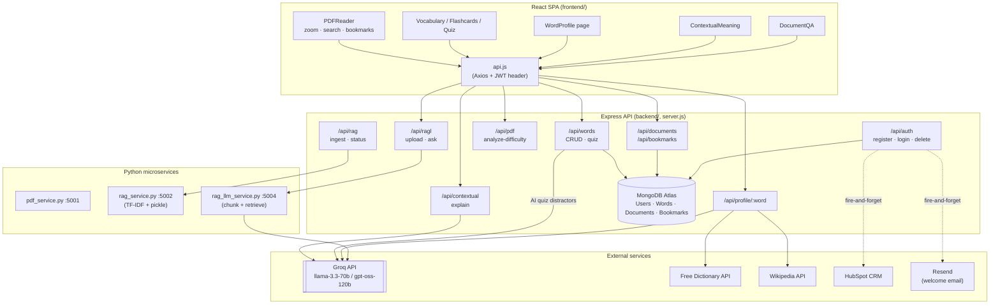
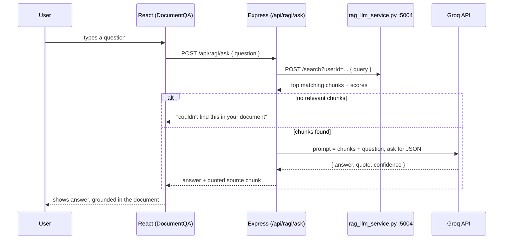

# 📚 WordKnit

A full-stack vocabulary-learning platform built on **MERN + Python microservices**. You read real PDFs inside the app, WordKnit flags the words that are actually hard *for you*, and turns them into flashcards, AI-explained meanings, and quizzes — instead of a generic word list you have to fill in by hand.

**Live:** [wordknit](https://my-mern-project-frontend-1.vercel.app/) · Backend: `my-mern-project-backend.vercel.app`

---

## ✨ Features

- **PDF reader** — upload and reopen PDFs, with zoom, in-document search, thumbnails, and bookmarks (highlighted text + optional note, tied to a page)
- **Difficulty analysis** — `scoreDifficulty()` scans an uploaded PDF's text and scores every word on length, academic prefixes/suffixes (`-tion`, `pseudo-`, …), and rarity in that specific document, then filters out words already in your vocab — so it surfaces words that are hard *for you*, not just long words
- **Word profiles** — combines a free dictionary API, Wikipedia (for academic terms), and Groq (`llama-3.3-70b-versatile`) into one page: definitions, pronunciation, synonym *nuances* (not just a synonym list — when to use each one), a memory hook, and usage examples
- **Contextual explain** — select a word inside a paragraph you're reading and ask "what does this mean *here*" — Groq answers using the surrounding text, not a generic definition
- **Document Q&A (RAG)** — ask a question about a document you've uploaded; the RAG-LLM service retrieves the most relevant chunks and Groq answers grounded in them, quoting the source
- **Flashcards & quizzes** — review words with correct/wrong tracking; quiz distractors are AI-generated plausible-but-wrong meanings (Groq), with a same-vocab fallback if that fails
- **JWT authentication** — stateless auth, auto-login right after registration, cascading account deletion (wipes words, bookmarks, and documents together)
- **HubSpot + Resend integration** — new signups fire-and-forget into a HubSpot CRM as contacts and get a welcome email, without ever blocking or breaking registration if either service is down
- **Wooden-bookshelf library UI** — saved PDFs are displayed as books on a shelf, each given a deterministic color derived from its title

## 🏗️ Tech stack

| Layer | Technology |
|---|---|
| Frontend | React 19, React Router v7, Axios |
| Backend | Node.js, Express, MongoDB (Atlas) |
| AI microservices | Python (PDF extraction, RAG dictionary, RAG+LLM Q&A) |
| AI model | Groq — `llama-3.3-70b-versatile` / `openai/gpt-oss-120b` |
| Auth | JWT + bcryptjs |
| Deployment | Vercel (frontend + backend), Docker (local/self-hosted) |

## 📂 Project structure

```
WordKnit/
├── frontend/                      # React SPA
│   └── src/
│       ├── pages/                 # Login, Register, Dashboard, Vocabulary,
│       │                          # Flashcards, Quiz, PDFReader, WordProfile,
│       │                          # ContextualMeaning, DocumentQA
│       ├── components/            # AppLayout, GazetteShell, WordList, Flashcard,
│       │                          # VocabTree, AddWord, YarnBallLogo, Navbar
│       ├── hooks/useTheme.js
│       └── api.js                 # Axios instance, attaches JWT to every request
│
├── backend/                       # Node + Express API
│   ├── routes/                    # auth, words, pdf, rag, ragl, contextual,
│   │                              # documents, bookmarks, wordProfile, (ocr — disabled)
│   ├── controllers/                # authController, wordController
│   ├── models/                     # User, Word, Document, Bookmark
│   ├── middleware/authMiddleware.js
│   ├── utils/hubspotService.js, aiSentence.js
│   ├── server.js                   # Express entry point
│   ├── pdf_service.py              # :5001 — raw PDF text extraction (OCR fallback path)
│   ├── rag_service.py              # :5002 — pickle-backed TF-IDF dictionary lookup
│   ├── rag_llm_service.py          # :5004 — document chunking + retrieval for Q&A
│   └── ocr_service.py              # :5003 — image OCR (route currently disabled)
│
├── docker-compose.yml
└── DOCKER.md
```

## 🔄 How it fits together



**Request flow — asking a question about an uploaded document:**



**Difficulty analysis** runs entirely inside the Express process (no Python round-trip): `pdf-parse` extracts text, `scoreDifficulty()` tokenizes and scores every candidate word (length, academic affixes, rarity, consonant clustering), filters out words already in the user's vocab, and returns the top 50 — which the Dashboard offers to add straight into the vocab list.

## 🚀 Getting started

**Backend**
```bash
cd backend
npm install
pip install -r requirements.txt

cat > .env << EOF
MONGO_URI=
JWT_SECRET=your_secret_key
GROQ_API_KEY=your_groq_key
HUBSPOT_PRIVATE_APP_TOKEN=your_hubspot_token   # optional
RESEND_API_KEY=your_resend_key                 # optional
PORT=5000
EOF

npm run dev                    # Express API on :5000
python rag_service.py          # dictionary RAG service on :5002
python rag_llm_service.py      # document Q&A service on :5004
# python pdf_service.py        # :5001, only needed for the OCR path (currently disabled)
```

**Frontend**
```bash
cd frontend
npm install
echo "REACT_APP_API_URL=http://localhost:5000" > .env
npm start                      # http://localhost:3000
```

**Docker (all-in-one)**
```bash
docker-compose up --build
```

## 📊 Key API endpoints

| Method | Endpoint | Purpose |
|---|---|---|
| POST | `/api/auth/register` / `/login` | Account creation & login (JWT) |
| DELETE | `/api/auth/account` | Delete account + cascade all user data |
| GET/POST | `/api/words` | List / add vocabulary words |
| GET | `/api/words/quiz` | Quiz questions with AI-generated distractors |
| POST | `/api/pdf/analyze-difficulty` | Score & return hardest words in an uploaded PDF |
| POST/GET | `/api/documents` | Upload / list saved PDFs |
| PATCH | `/api/documents/:id` | Update last-read page |
| POST/GET | `/api/bookmarks` | Save / list highlighted bookmarks |
| POST | `/api/contextual/explain` | Explain a word using its surrounding paragraph |
| POST | `/api/ragl/upload` / `/ask` | Index a document / ask grounded questions about it |
| GET | `/api/profile/:word` | Full word profile (dictionary + Wikipedia + Groq) |

## 🔐 Security

- Passwords hashed with bcryptjs; JWT-based stateless auth (`authMiddleware` protects all user routes)
- Third-party integrations (HubSpot, Resend) are fire-and-forget — a slow or failed call never blocks or breaks registration
- Saved documents are keyed by an unguessable Mongo ObjectId; delete-account cascades across Words, Bookmarks, and Documents in one `Promise.all`

## 🐳 Docker

See `DOCKER.md` for the full container setup — `docker-compose.yml` runs MongoDB, the Express API, and the frontend together.

## 📄 License

ISC License — see repository for details.

## 👤 Author

**Mariam** — [GitHub](https://github.com/Mariam-gitt)
